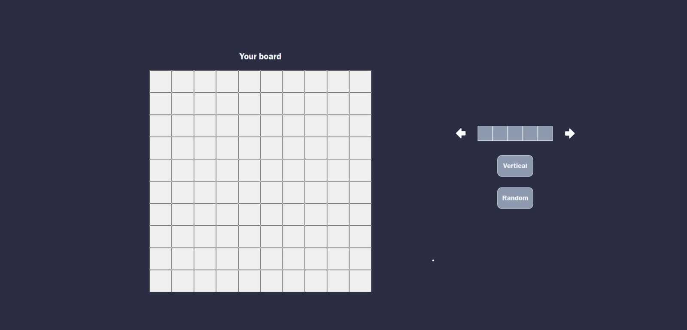

# Battleship

This is a browser-based implementation of the classic game Battleship. In this game, you will try to sink all of your opponent's ships before they sink yours. Are you ready for the challenge?

## Technologies Used

- HTML
- CSS
- JavaScript

## How to Play

1. Press a link: https://ikojun00.github.io/TOP/battleship/dist/index.html
2. The game will load, and you will see your board and ships.
3. By pressing a button called Random, ships are going to be placed randomly on your board.
4. Also, you can place your ships on your grid by clicking and holding cells and dropping them on the grid.
   You can rotate the ship by pressing a button called Horizontal or Vertical.
5. Once you have placed your ships, the game will begin. Click on the opponent's grid to attack a cell.
6. The game will indicate whether your attack was a hit or a miss.
7. Your opponent will then take their turn, attacking cells on your grid.
8. Continue taking turns until one player sinks all of the opponent's ships.

## Rules

- The game is played on a 10x10 grid.
- Each player has five ships: Carrier (5 cells), Battleship (4 cells), Cruiser (3 cells), Submarine (3 cells), and Destroyer (2 cells).
- Players take turns choosing a cell on the opponent's grid to attack.
- If the chosen cell contains a part of a ship, it's a hit. Otherwise, it's a miss.
- After each attack, the result (hit or miss) will be displayed on the screen.
- The game ends when one player sinks all of the opponent's ships.

## Acknowledgments

- The Odin Project: [https://www.theodinproject.com/](https://www.theodinproject.com/)
