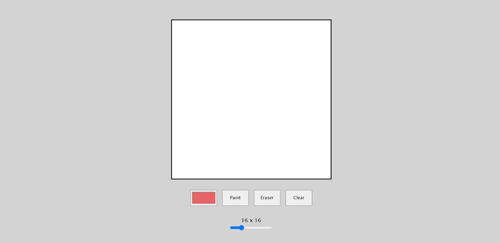

# Etch A Sketch

This is a drawing application that allows users to draw whatever they want.

## Technologies Used

- HTML
- CSS
- JavaScript

## How to Use

1. Press a link: https://ikojun00.github.io/TOP/etch-a-sketch/index.html
2. By pressing a button called Paint, you can draw on your board by left-clicking and holding your mouse.
3. By pressing a button called Clear, the board is cleared from your sketches.
4. By pressing a button called Eraser, you can erase more precisely parts of your sketch on your board by left-clicking and holding your mouse.
5. Changing the size of your slider to higher numbers makes your drawing more narrow.
6. Also, you can paint with different colors by pressing a colored button.

## Acknowledgments

- The Odin Project: [https://www.theodinproject.com/](https://www.theodinproject.com/)
