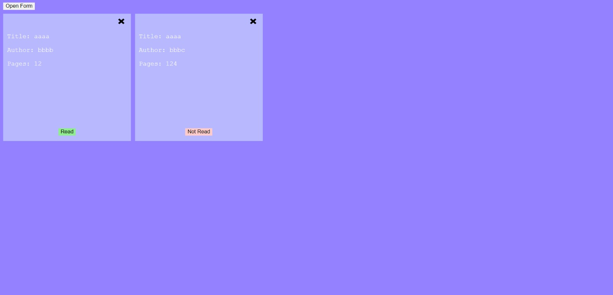

# Library

This is a book management application that allows users to store their books and mark them as read or not read.

## Technologies Used

- HTML
- CSS
- JavaScript

## How to Use

1. Press a link: https://ikojun00.github.io/TOP/library/index.html
2. By pressing a button called Open Form, you can input informations about the book.
3. By pressing a button called Add Book, the book is saved as card.
4. By pressing a button called Close Form, you can close form for inputing informations.
5. Book, represented by card, can be removed with X in top right corner of card.
6. Also, you can mark book as Read or Not Read.

## Acknowledgments

- The Odin Project: [https://www.theodinproject.com/](https://www.theodinproject.com/)
