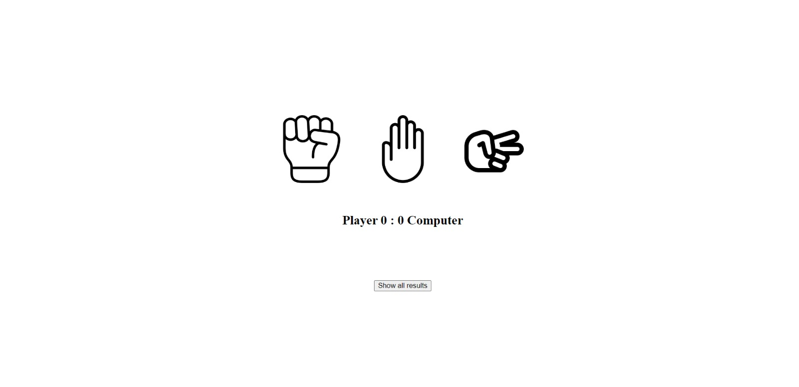

# Rock Paper Scissors

This is a simple implementation of the classic game Rock Paper Scissors.

## Technologies Used

- HTML
- CSS
- JavaScript

## How to Play

1. Press a link: https://ikojun00.github.io/TOP/rock-paper-scissors/index.html
2. The game will prompt you to press your choice between symbol of rock, paper and scissors.
3. The game will determine a winner of the round between AI and you based on this rules:
   - Rock beats scissors
   - Scissors beats paper
   - Paper beats rock
4. The winner of a game is the player who wins 5 rounds first.

## Acknowledgments

- The Odin Project: [https://www.theodinproject.com/](https://www.theodinproject.com/)
