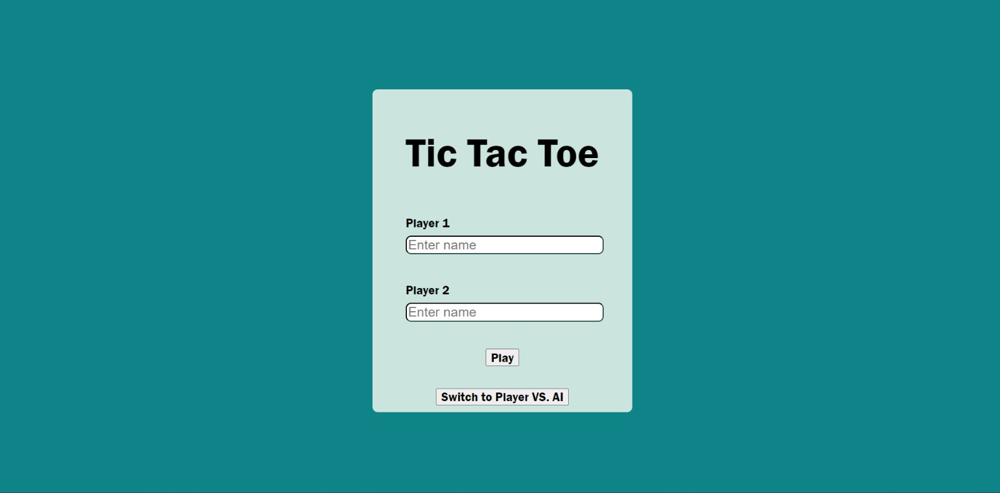

# Tic Tac Toe

Tic-Tac-Toe is a classic game where two players take turns marking cells on a 3x3 grid in an attempt to get three of their symbols in a row, column, or diagonal.

.jpeg>)

## Technologies Used

- HTML
- CSS
- JavaScript

## Features

- Human vs. Human: Play against a friend on the same computer.
- Human vs. AI: Play against the computer.
- Interactive Interface: Click on cells to mark them with X or O.
- Winner Detection: Automatically determines the winner or declares a draw.
- Score that keeps a track of wins.
- Responsive design for optimal use on different devices.

## Usage

1. Press a link: https://ikojun00.github.io/TOP/tic-tac-toe/index.html.
2. Choose between Human vs. Human and Human vs. AI.
3. Choose a difficulty of AI (if Human vs. AI).
4. The game board will be displayed on the screen with empty cells.
5. Click on an empty cell to mark it with your symbol (X or O).
6. Players take turns marking cells until one player wins by getting three of their symbols in a row, column, or diagonal, or the game ends in a draw.
7. To return to a round's beginning, click the restart button.

## Acknowledgements

- The Odin Project: [https://www.theodinproject.com/](https://www.theodinproject.com/)
