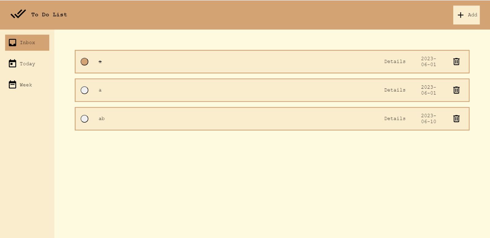

# To Do List

This is a simple to-do list application created as part of The Odin Project curriculum. It allows users to create, manage, and organize their tasks in a convenient way.

## Technologies Used

- HTML
- CSS
- JavaScript

## Features

- Add new tasks with a title and optional description.
- Mark tasks as completed.
- Edit task details such as title and description.
- Delete tasks.
- Persist data using local storage.
- Responsive design for optimal use on different devices.

## Usage

1. Press a link: https://ikojun00.github.io/TOP/to-do-list/dist/index.html
2. Click the "Add" button to create a new task and enter a task title and due date in the input field.
3. To mark a task as completed, click the checkbox next to the task.
4. To delete a task, click the Trash can icon next to the task.
5. Choose inbox to see all todos, today to see todos for today or week to see todos for this week.

## Acknowledgements

- The Odin Project: [https://www.theodinproject.com/](https://www.theodinproject.com/)
